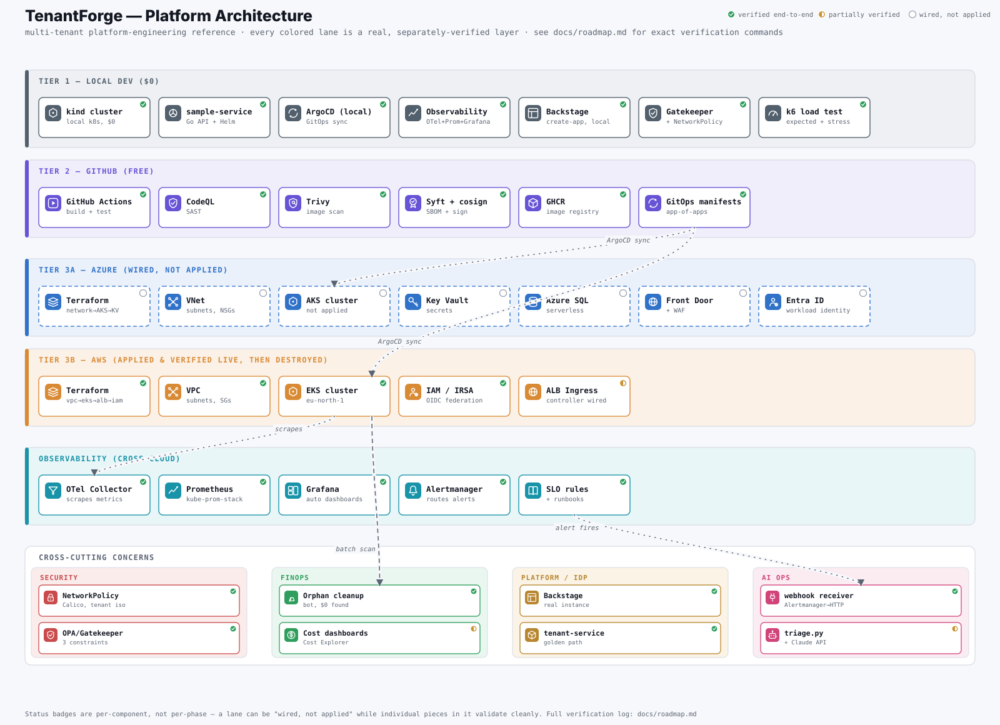

# TenantForge

[](https://github.com/chethankumblekar/tenantforge/actions/workflows/ci.yml)
[](https://github.com/chethankumblekar/tenantforge/actions/workflows/codeql.yml)
[](LICENSE)
[](CODE_OF_CONDUCT.md)

A production-grade, well-architected multi-tenant platform on Azure, with a
portable AWS reference implementation proving the same modules aren't
locked to one cloud. See [docs/architecture.md](docs/architecture.md) for
the full design and [docs/roadmap.md](docs/roadmap.md) for current phase
status.

## Architecture

[](https://chethankumblekar.github.io/tenantforge/architecture-map.html)

Every colored lane is a separately verified layer, and each component carries
its own status badge — verified end-to-end, partially verified, or wired but
not applied. [Open the interactive map](https://chethankumblekar.github.io/tenantforge/architecture-map.html)
to hover any component for the exact verification behind it.

## What this is

Two layers, shipped together:

1. **The Platform** — a self-service, golden-path system for standing up
   secure, observable, cost-governed multi-tenant services on Azure.
2. **The Reference Workload** — one deliberately simple multi-tenant service
   that exists only to prove the platform works end-to-end.

Covers: Terraform IaC, AKS, Helm, ArgoCD GitOps, DevSecOps supply-chain
security (SAST/scan/SBOM/signing), zero-trust identity (Entra Workload
Identity Federation), observability (OpenTelemetry/Prometheus/Grafana/SLOs),
Backstage-based Internal Developer Platform, and FinOps cost governance —
each mapped explicitly to Microsoft's Well-Architected Framework pillars in
[docs/well-architected-review.md](docs/well-architected-review.md).

## Status

The AWS reference implementation, the containerized reference workload,
the CI/CD supply-chain pipeline, ArgoCD GitOps, the observability stack
(metrics, SLO alerting, dashboards, runbooks), tenant NetworkPolicy +
OPA/Gatekeeper admission policy, and the Backstage self-service onboarding
template are built and verified against real infrastructure. The primary
Azure landing zone is wired in Terraform but not yet applied. See
[docs/roadmap.md](docs/roadmap.md) for exact phase-by-phase status and
verification notes, [docs/tour/README.md](docs/tour/README.md) for a
phase-by-phase walkthrough with screenshots/CLI proof, and
[ADR-0002](docs/adr/0002-appservice-to-aks-pivot.md) for the most recent
architectural decision (App Service → AKS).

## Repo layout

```
docs/                    architecture, ADRs, roadmap, runbooks
infra/terraform/azure/   primary landing zone (Terraform modules + envs)
infra/terraform/aws/     portable reference implementation, applied and verified
platform/                Backstage golden paths (built), ArgoCD app-of-apps
workloads/               the reference service
observability/           OTel collector, Prometheus SLOs, Grafana dashboards
security/                NetworkPolicy, OPA/Gatekeeper admission policy
finops/                  cost dashboards, budget alerts, orphan-cleanup bot
ai-ops-assistant/        stretch-goal alert-triage assistant
.github/workflows/       CI + per-cloud deploy workflows
```

## Cost strategy

This is built to run on $0–10 total, not hundreds. See
[docs/roadmap.md](docs/roadmap.md#cost-tiers-from-adr-0001) for the tiered
approach: local `kind` cluster for daily iteration, GitHub's free tier for
CI, real Azure/AWS only in short paid bursts (`apply` → demo → `destroy`).

## Quickstart (once Phase 1 lands)

```bash
cd infra/terraform/azure
terraform init
terraform plan -var-file=envs/dev/dev.tfvars
```

`terraform apply` is deliberately not run casually — it costs real money.
Set an Azure budget + spend alert first (see
[finops/budget-alerts](finops/budget-alerts/README.md), not yet automated).

## Testing

`scripts/test-all.sh` runs every automated check (Go, Helm, Terraform,
OPA/Gatekeeper, Kubernetes manifests, Backstage) in one command — see
[TESTING.md](TESTING.md) for what's covered, what's intentionally manual,
and why the Gatekeeper policy tests exist.

## Contributing

See [CONTRIBUTING.md](CONTRIBUTING.md) for the development workflow, ADR
process, and code conventions. This project follows the
[Contributor Covenant](CODE_OF_CONDUCT.md). Found a security issue? See
[SECURITY.md](SECURITY.md) rather than opening a public issue.

## License

[MIT](LICENSE)
