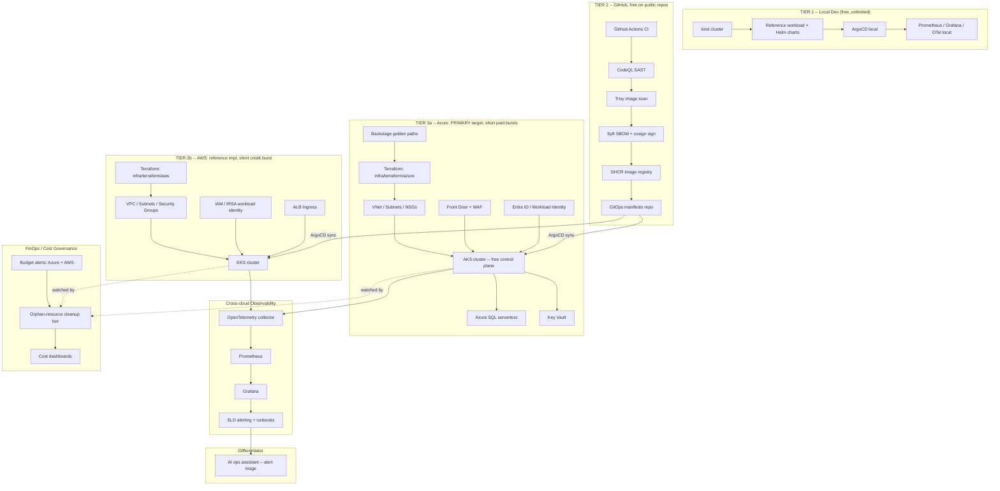

# Architecture

TenantForge is two layers shipped together:

1. **The Platform** — a self-service, golden-path system for standing up
   secure, observable, cost-governed multi-tenant services on Azure. This is
   the real deliverable and the thing that proves "Platform Engineer," not
   just "DevOps Engineer."
2. **The Reference Workload** — one deliberately simple multi-tenant API
   service that exists only to prove the platform works end-to-end. Kept
   boring on purpose — the platform is the star.

## Diagram

## Current state (see [docs/roadmap.md](roadmap.md) for phase status)

Phase 1 (Azure landing zone) is in progress: `infra/terraform/azure` wires
`resource_group -> network -> aks -> keyvault -> monitoring -> policy`. AKS
replaced App Service as the compute target — see
[ADR-0002](adr/0002-appservice-to-aks-pivot.md) for why. Nothing in this
diagram beyond the Azure landing-zone modules has been built yet; the tree
under `platform/`, `workloads/`, `observability/`, `security/`, `finops/`,
and `ai-ops-assistant/` is scaffolded with placeholder READMEs pointing at
the phase that fills them in.

## Tech stack by layer

| Layer | Tools | Gap closed |
|---|---|---|
| IaC | Terraform (modules + Terraform Cloud remote state), Azure Policy-as-code | Terraform depth |
| Compute | AKS, node autoscaling (later), Azure Container Apps for lighter services (stretch) | K8s production depth |
| Packaging & delivery | Helm, ArgoCD (app-of-apps GitOps) | Helm + GitOps |
| CI/CD & supply chain | GitHub Actions, CodeQL (SAST), Trivy (image scan), Syft (SBOM), cosign (signing) | DevSecOps / supply-chain security |
| Identity | Microsoft Entra Workload Identity Federation (OIDC, no static cloud secrets), Key Vault | Zero-trust patterns |
| Networking/Edge | Azure Front Door + WAF, Kubernetes NetworkPolicies | Reinforces existing strength |
| Observability | OpenTelemetry, Prometheus, Grafana, SLO/error-budget alerting | Formalizes production uptime experience |
| Platform/IDP | Backstage software templates for tenant/service onboarding | Platform Engineering / golden paths |
| FinOps | Orphan-resource bot, Cost Management API dashboards | Cost Optimization pillar |
| Differentiator | Small AI ops assistant (alert triage) | Agentic AI ops |
